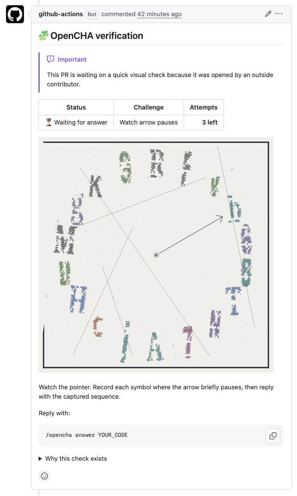
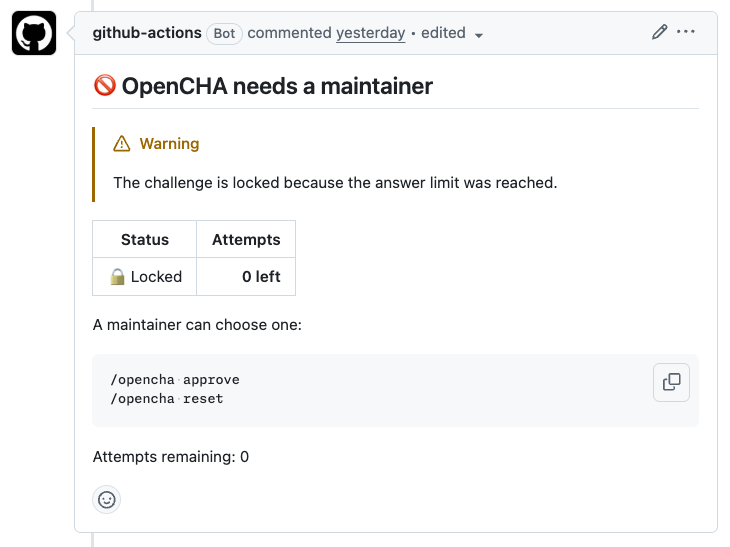

# OpenCHA

A simple verification gate that reduces low-effort pull request noise for maintainers.

OpenCHA does not try to detect or block AI agents. It gates low-effort, unverified contributions before they become maintainer review work.

## What OpenCHA Does

OpenCHA runs as a GitHub Action. When an untrusted outside contributor opens a pull request, OpenCHA can mark the PR as verifying, create a visual challenge, and keep the `OpenCHA` check in progress until the PR author answers correctly or a maintainer approves it.

## What OpenCHA Does Not Do

OpenCHA is not an AI detector, a strong anti-bot system, or a replacement for maintainer review.

## How It Looks

A verifying PR starts with a visual challenge. If the author runs out of attempts, OpenCHA moves the PR into a maintainer-needed state.

<table>
  <tr>
    <td width="50%" valign="top">
      <strong>Challenge</strong><br>
      
    </td>
    <td width="50%" valign="top">
      <strong>Needs maintainer</strong><br>
      
    </td>
  </tr>
</table>

## Installation

Create `.github/workflows/opencha.yml`:

```yaml
name: OpenCHA

on:
  pull_request_target:
    types: [opened, reopened, ready_for_review, unlabeled, synchronize]
  issue_comment:
    types: [created]

permissions:
  contents: write
  pull-requests: write
  issues: write
  checks: write

concurrency:
  group: opencha-${{ github.event.pull_request.number || github.event.issue.number }}
  cancel-in-progress: false

jobs:
  opencha:
    runs-on: ubuntu-latest
    steps:
      - uses: opencha/opencha@v0
        with:
          github-token: ${{ secrets.GITHUB_TOKEN }}
          opencha-secret: ${{ secrets.OPENCHA_SECRET }}
```

Add a repository secret named `OPENCHA_SECRET`. OpenCHA does not restrict the character set or length, but a random value is recommended because it is used to derive encryption keys.

## Configuration

OpenCHA reads `.github/opencha.yml` from the pull request base branch. If the file is absent, defaults are used. Unknown fields warn and are ignored. Invalid values fail closed.

```yaml
trusted_users:
  - alice

trusted_bots:
  - my-bot[bot]

labels:
  verifying: "opencha: verifying"
  needs_maintainer: "opencha: needs maintainer"

challenge:
  code_count: 5
  max_attempts: 5
  cooldown_seconds: 30
  rotate_on_wrong_answer: false

assets:
  branch: opencha-assets
  cleanup_passed_assets: false

policy:
  reverify_on_push: false
```

`challenge.code_count` is accepted for compatibility with existing configuration. The default temporal challenge chooses a 5- or 6-pause captured sequence.

## Challenge Flow

The MVP challenge renders a 3x3 visual grid in the GitHub comment. The center cell is an animated pointer GIF, and the eight surrounding cells are independent noisy code GIFs with non-uniform displayed sizes. Each surrounding GIF contains short ASCII-art characters. The pointer target angles are derived from the displayed position of each readable character in the surrounding cells, so diagonal and side cells can target individual characters instead of only the containing GIF. The PR author watches the center pointer, records the character where the arrow briefly pauses, and replies with the captured characters in order.

No single frame is intended to show the complete answer. Solving requires observing the center animation timeline and combining it with the rendered GitHub comment layout. The surrounding code GIFs do not need to stay synchronized with the center pointer; each surrounding cell keeps the same code meaning throughout its short noisy loop. OpenCHA still bundles Noto Sans Bold, Noto Serif Bold, Anton, and Oswald Bold TTF files for local font rasterization, and the renderer converts glyph outlines into ASCII density cells before drawing the GIFs.

Untrusted PR authors reply to the challenge with:

```text
/opencha answer YOUR_CODE
```

Only the PR author can pass with `/opencha answer`.

## Maintainer Commands

Trusted maintainers and collaborators can use:

```text
/opencha approve
/opencha reset
```

## Security Model

OpenCHA uses `pull_request_target` only for repository metadata and GitHub operations. It does not checkout or execute pull request code.

OpenCHA also reads configuration from the pull request base branch, so an untrusted PR cannot change OpenCHA policy from the same PR.

Challenge state is stored in encrypted PR comment payloads using AES-256-GCM with a key derived from `opencha-secret` using HKDF-SHA256. Challenge GIF URLs are public information. OpenCHA does not rely on hiding the image.

## Limitations

OpenCHA's MVP challenge is visual and is not accessible to all contributors. Maintainers should provide a manual override path with `/opencha approve`.

OpenCHA is not a strong anti-bot or anti-OCR system. It is a small deliberate-effort gate for maintainers.

OpenCHA currently stores challenge GIFs by committing them to a dedicated repository branch. You can configure `assets.branch`, but other asset storage backends are not supported yet.

Set `assets.cleanup_passed_assets` to `true` only if you prefer removing challenge GIFs from the asset branch tip after pass/reset flows. Keeping the default `false` preserves historical challenge images in GitHub comments.

## Development

```bash
pnpm install
pnpm typecheck
pnpm test
pnpm build
pnpm verify
```

`dist/index.js` is committed for GitHub Action distribution. CI should verify the bundle is current.
